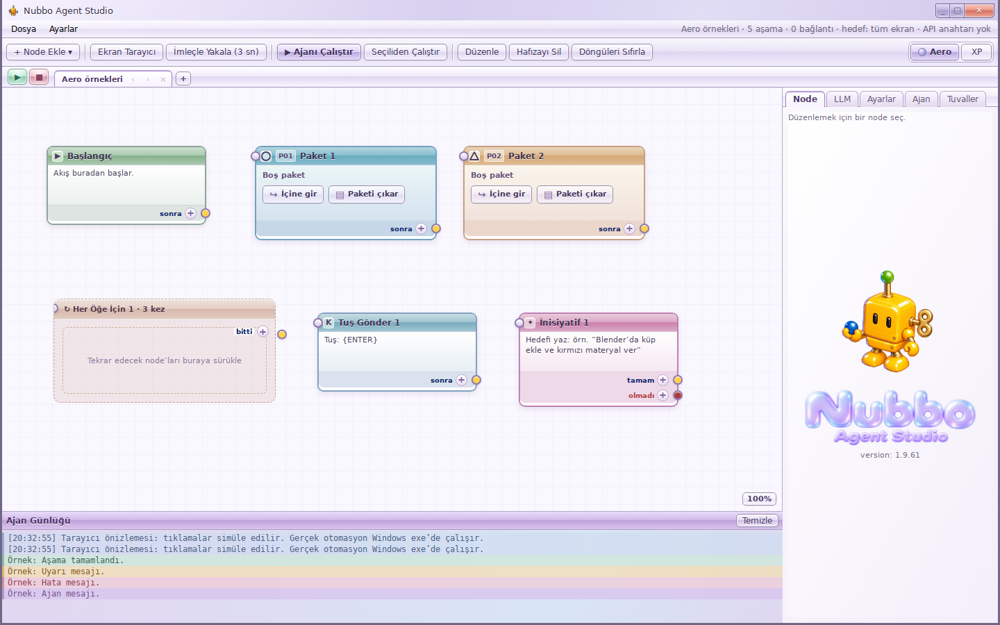

# Lilac Aero / XP

Use the Aero and XP buttons at the right of the main toolbar. Aero is the default; the selection is saved on this device and restored before the renderer mounts. The OCR engine remains unchanged; only its static toolbar indicator has been replaced.

Aero uses a lightly translucent lilac glass frame, glossy controls, white content surfaces, pastel node headers, and a light log panel. It covers the canvas, inspectors, LLM/settings/agent panels, library, menus, scanner, confirmation dialogs, help tooltips and the floating HUD. The HUD also follows theme changes from the main window. XP retains the existing Luna appearance.

The skin lives in `src/styles/aero.css`, scoped by `html[data-theme='aero']`. The underlying canvas geometry, node dimensions, hit targets and flow data are shared. Node-kind colors remain identifiable in the glass headers; running, stopped, error and completed states retain their distinct colors. Theme buttons work while a flow is running.

## Screenshots

Browser renderer, 1440 × 900 (Windows desktop automation is not exercised):

## Validation

- `npm run typecheck`
- `npm run build:renderer`
- `npm test`: 489 passed; 5 existing skips
- Headless browser: Aero default, both theme buttons, persisted choice across reloads, unchanged node dimensions, all five sidebar tabs, scanner opening/closing, controls visible at 1024 × 768, cross-window HUD theme synchronization and no page errors.

On Windows 11 22H2+ (build 22621+), Aero requests the native DWM Acrylic backdrop. The HTML/window shell is transparent only after the main process confirms that request. XP disables Acrylic and restores an opaque background. Other systems and effect failures keep an opaque fallback. The ordinary main window remains resizable; the `transparent: true` window mode is not used. The second decorative outer frame has been removed. Inputs remain opaque, node bodies keep a high-opacity white backing, and no whole-window opacity is applied to text or controls.

Windows executable packaging and native desktop input were not tested in this Linux environment.

## Aero brand assets

`src/assets/nubbo-aero.png` and `src/assets/nubbo-logo-aero.png` are transparent PNGs generated from the original robot and wordmark with the built-in image generation tool. Prompt direction: preserve the wind-up robot, gold winding key, green antenna and held blue sphere; use opaque glossy yellow-orange plastic with soft Windows 7 casual-game-era shading and icy cyan highlights; preserve the exact two-line text “Nubbo / Agent Studio”. Aero uses the new still mascot in the sidebar and HUD; XP keeps its original animated mascot and logo. The new Aero mascot is not an animation.

Both skins share window, toolbar, canvas, node and brand-slot geometry. Graph positions and viewport state remain in the same React canvas instance; themes do not create another graph, remount the canvas or store their own coordinates. Browser checks compare the full node/canvas/sidebar/log/toolbar bounding rectangles across theme switches.

Node-kind colors now tint the stronger glossy headers, quiet body gradient, output strip and border. The log uses restrained blue/info, mint/success, amber/warning, rose/error and lilac/chat tints; geometry stays shared.

Updated window controls follow the supplied joined-button reference, with a wider coral Close button. Only this explicitly requested Close-button width changes; the other layout proportions remain shared. Package colors use brighter Aero-specific counterparts without changing XP identities. Loop frames use amber glass. Log empty space has a lavender/ice-blue fill, and sequence Play/Stop controls have mint/rose glossy surfaces. The robot now uses the user-approved shape with opaque glossy plastic, retaining the Aero wordmark.

The sidebar mascot uses the original mirrored presentation above the wordmark. Final material polish adds restrained lacquer highlights while keeping the robot opaque; the logo stays unchanged.

The extra colored log rows in this screenshot are labeled preview examples. Package/loop/sequence-control bounding rectangles match XP in browser verification.
