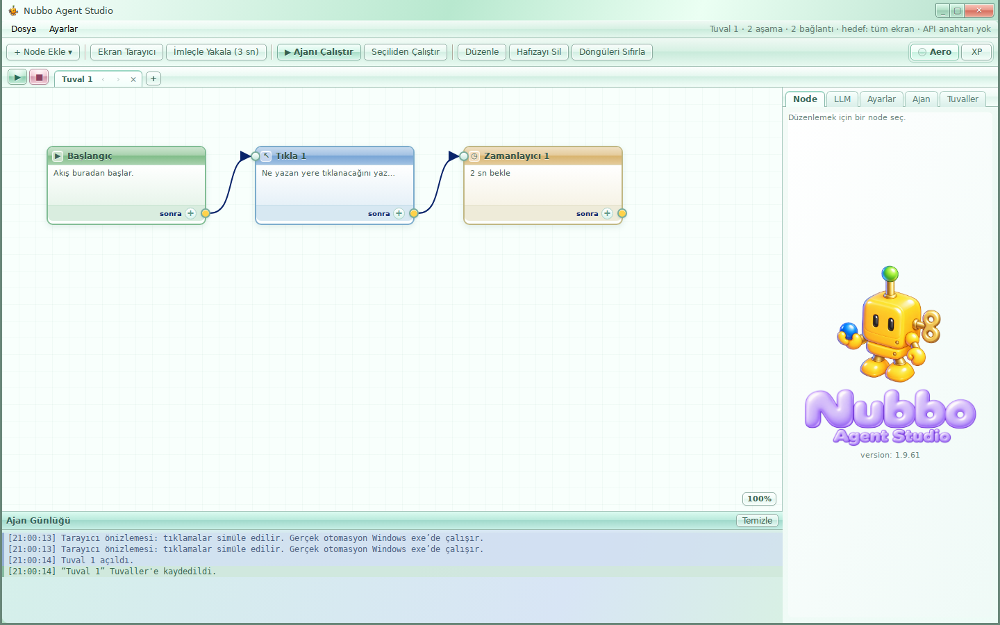
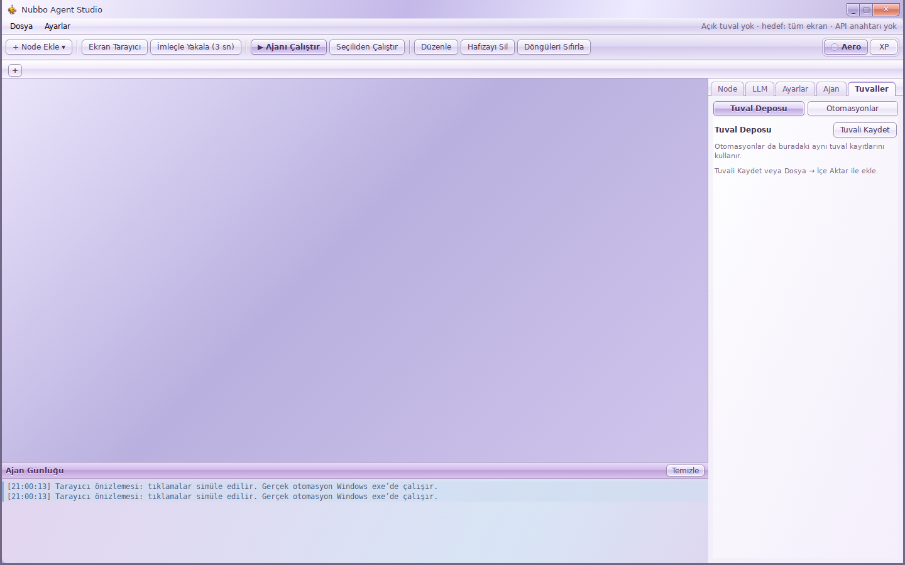
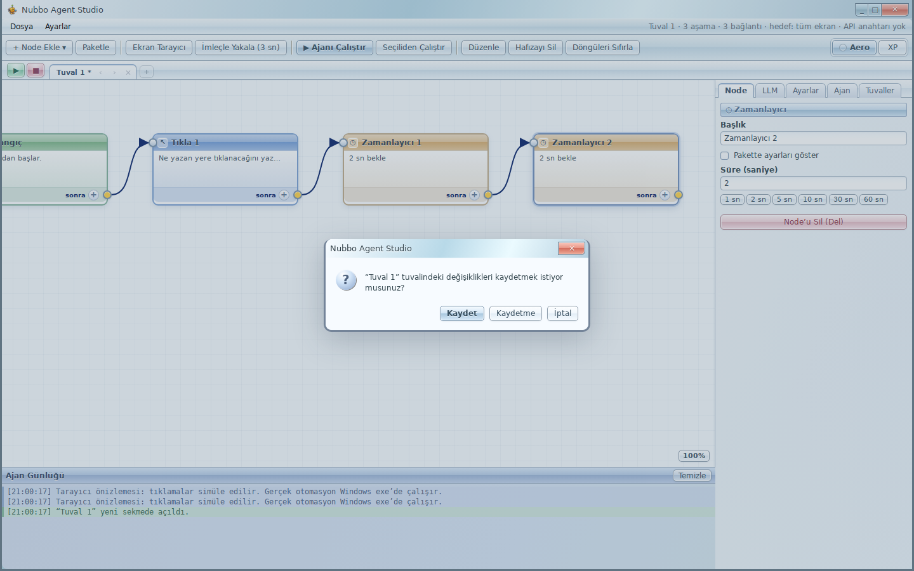

# Nubbo Aero / XP and canvas sessions

Aero is the default skin. Every press of the Aero button advances the UI palette: lilac → sky blue → mint → peach → lilac. XP keeps the existing Luna appearance. Both the skin and the Aero palette are persisted and synchronized with the floating HUD. Brand images, node identities and success/error/warning colors keep their own colors.

The main window is fully opaque. The experimental native Acrylic effect and its IPC API have been removed. There is no transparent main-window mode or desktop backdrop request. The floating HUD retains its original transparent surroundings.

The skin is scoped by `html[data-theme='aero']`. Geometry, flow data and the live canvas viewport remain shared; selecting a skin or color does not remount the canvas or introduce another set of node positions. Window controls keep the reference-shaped joined buttons and wider coral Close. Packages have stronger identifying colors, loops have amber shading, logs have restrained semantic tints, and sequence Play/Stop have glossy mint/rose surfaces.

## Canvas and automation behavior

- Launch opens no canvas or automation. The tab row contains only `+`; the editor is absent until a canvas is created or opened. The right sidebar starts on Tuvaller and retains the depot and automation lists.
- `+` creates a working canvas. Closing the last canvas returns to the empty workspace.
- Changed working canvases show `*`. Explicit Save writes the canonical depot record used by all automation containers.
- Application close, individual tab close, and replacing tabs with an automation review changed canvases in order, with **Kaydet / Kaydetme / İptal**. Clean canvases are skipped. Cancel preserves the tabs; failed disk writes block closure.
- A native window close or app quit waits for renderer review. Repeated and stale close requests cannot bypass it. A running sequence is stopped and its final patches are retained before review.
- Draft writes and explicit saves are serialized. A delayed draft cannot overwrite the final save or reintroduce discarded tabs.
- Automation creation, membership changes and ordering persist immediately. Names persist on blur/Enter and are flushed on program close. There is no separate automation Save requirement. Failed writes retain the attempted edit and provide Retry; stale edits cannot replace newer records.
- Previously interrupted/legacy unsaved work is recovered into the depot when starting with an empty editor. Recovery uses a separate record and does not overwrite the saved canvas referenced by automations. A normal successful close clears working tabs, so discarded changes do not return.

The automation execution engine, node commands, OCR and LLM behavior are unchanged. Session management and persistence are intentionally changed as requested.

## Brand assets

The transparent PNGs `src/assets/nubbo-aero.png` and `src/assets/nubbo-logo-aero.png` were edited with the built-in image generation tool using the supplied Windows 7 casual-game character shading reference.

Mascot prompt: preserve the existing robot silhouette, proportions, pose, two black vertical eyes, lower-left dot, gold winding key, green antenna and held blue sphere. Keep the warm yellow/gold, green and blue palette; use soft airbrushed opaque toy surfaces, broad gentle gradients, slightly reduced saturation, restrained highlights and no sharp chrome or glass reflections. Keep the original mirrored sidebar presentation.

Logo prompt: preserve the exact two-line wording “Nubbo / Agent Studio”, rounded letterforms and composition; replace translucent neon glass with opaque softly glossy lavender toy shading, broad pale highlights and subtle lavender contours. Both outputs retain real alpha backgrounds. Aero uses the new still mascot; XP retains its original low-frame-rate animation.

Visible mascot bounds, rather than PNG dimensions, are calibrated against the XP still frame. The shared sidebar slot remains 186 × 186 px and the logo slot remains unchanged. The HUD applies the same calibration in its existing slot. Browser verification compares the visible bounds within 0.1 px.

## Validation

- `npm run typecheck`
- `npm run build:electron` (renderer and main)
- `npm test`: 497 passed; 5 existing skips
- Real React/runner tests: selected-node and package-path execution retained; empty startup, per-canvas save/discard/cancel, last-tab closure, failed persistence, final stopped-run patches and native close acknowledgement.
- Automation editor tests: immediate add/remove/reorder/name persistence, persistent new containers, failed-write retry, stale-write rejection and asynchronous write locks.
- Headless browser: empty startup, creation and depot opening, save/discard/cancel dialog, opaque four-color cycling, reload persistence, unchanged node/package/loop/panel dimensions, equal visible mascot bounds, HUD synchronization, controls fitting 1024 × 768 and no page errors.

Windows executable packaging, native Alt+F4/app quit and actual desktop automation were not exercised in this Linux environment. Native close coordination is covered by the gate and renderer tests. The deliverable is source plus Git patches, not a Windows EXE.

## Browser screenshots

Extra colored log rows in the details screenshot are explicitly labeled preview examples.
