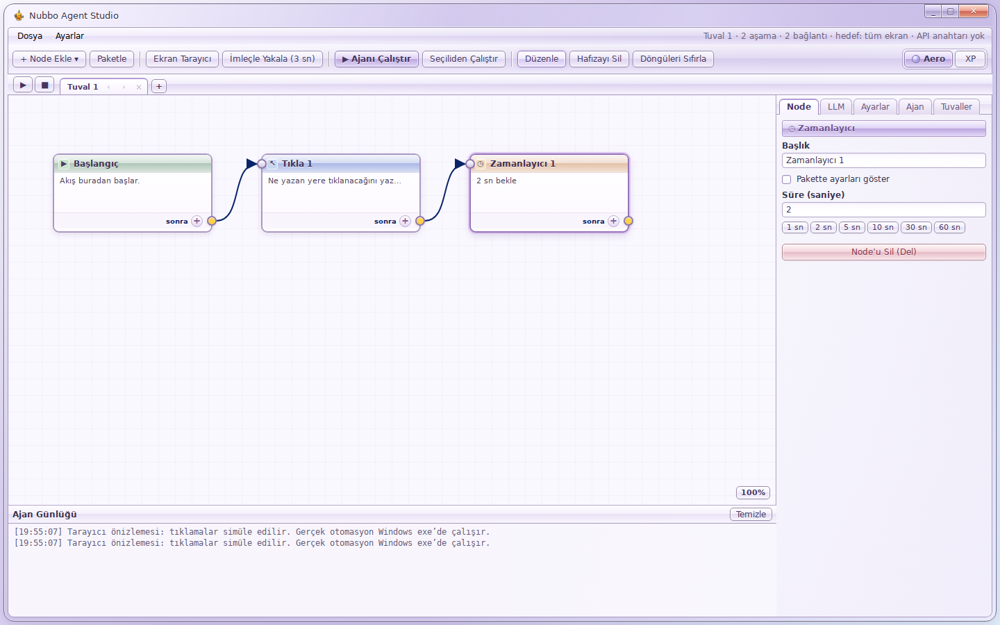
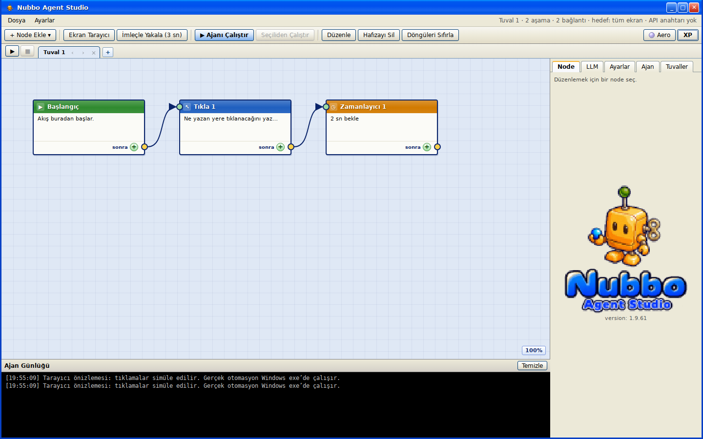

# Lilac Aero / XP

Use the Aero and XP buttons at the right of the main toolbar. Aero is the default; the selection is saved on this device and restored before the renderer mounts. The OCR engine remains unchanged; only its static toolbar indicator has been replaced.

Aero uses a lightly translucent lilac glass frame, glossy controls, white content surfaces, pastel node headers, and a light log panel. It covers the canvas, inspectors, LLM/settings/agent panels, library, menus, scanner, confirmation dialogs, help tooltips and the floating HUD. The HUD also follows theme changes from the main window. XP retains the existing Luna appearance.

The skin lives in `src/styles/aero.css`, scoped by `html[data-theme='aero']`. The underlying canvas geometry, node dimensions, hit targets and flow data are shared. Node-kind colors remain identifiable in the glass headers; running, stopped, error and completed states retain their distinct colors. Theme buttons work while a flow is running.

## Screenshots

Browser renderer, 1440 × 900 (Windows desktop automation is not exercised):

## Validation

- `npm run typecheck`
- `npm run build:renderer`
- `npm test`: 481 passed; 5 existing skips
- Headless browser: Aero default, both theme buttons, persisted choice across reloads, unchanged node dimensions, all five sidebar tabs, scanner opening/closing, controls visible at 1024 × 768, cross-window HUD theme synchronization and no page errors.

Translucent surfaces blend with the app’s lilac/ice-blue backdrop. This is in-app glass; the main native window stays opaque and resizable. Inputs remain opaque, node bodies keep a high-opacity white backing, and no whole-window opacity is applied to text or controls.

Windows executable packaging and native desktop input were not tested in this Linux environment.
